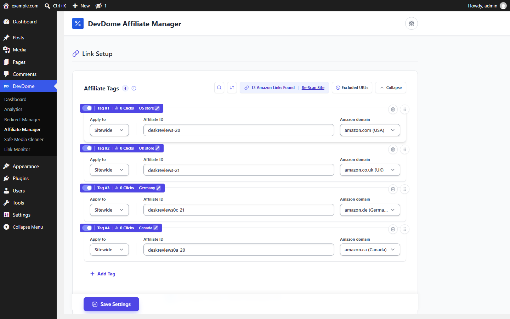
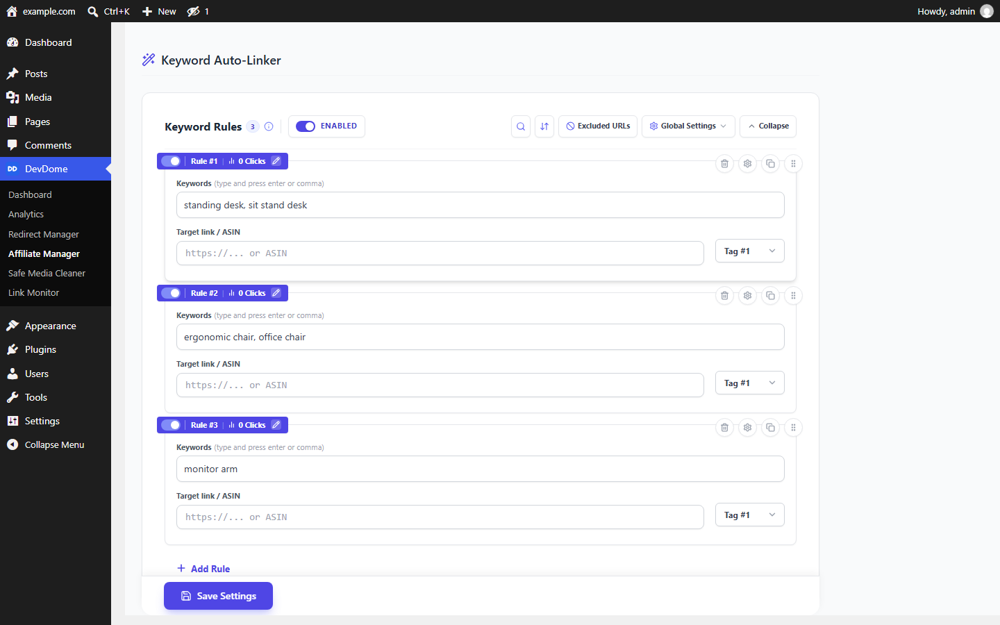
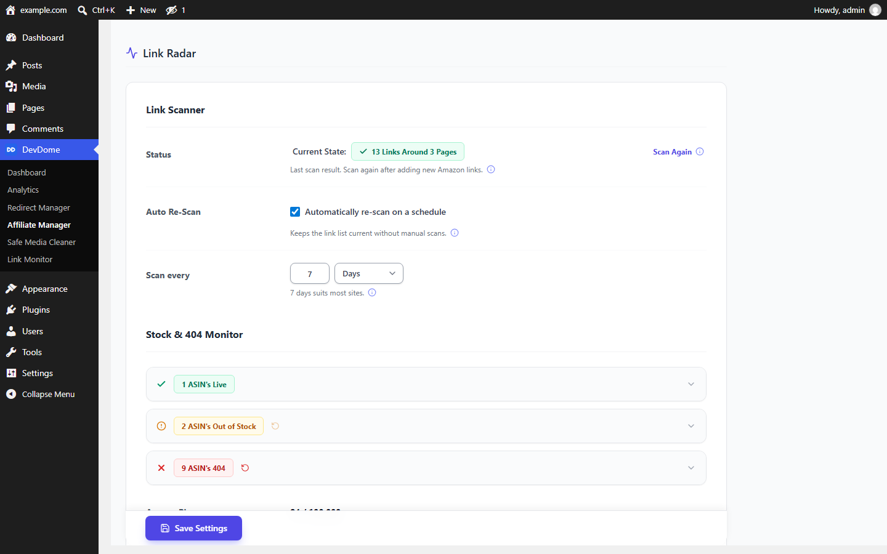
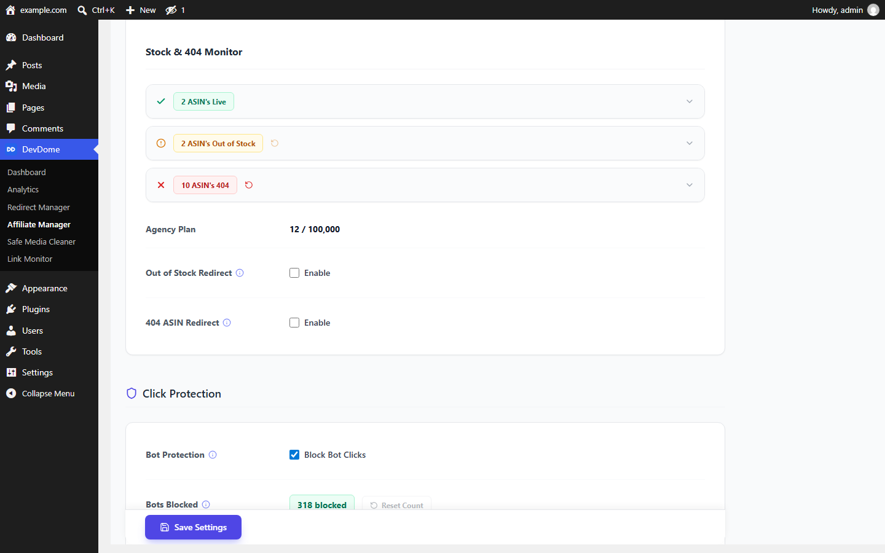
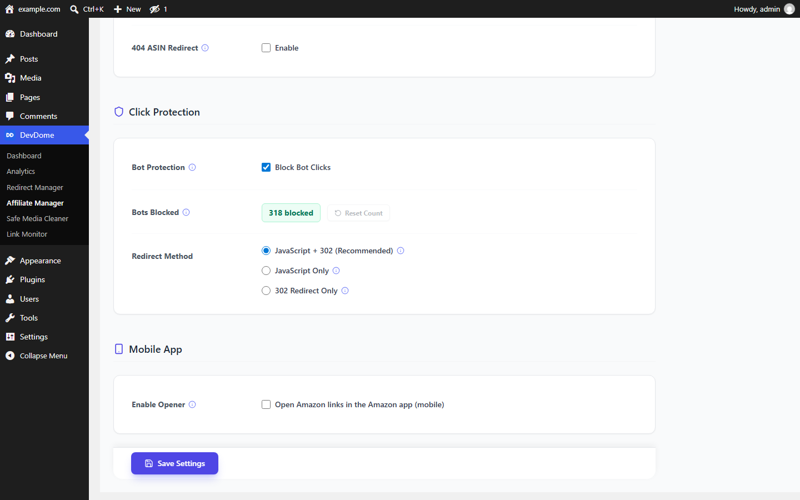

# DevDome Affiliate Manager: Amazon Affiliate Plugin for Amazon Associates

Amazon Affiliate WordPress Plugin: tag Amazon affiliate links, check Amazon product links, replace dead ASINs, earn commission as an Amazon Associate. Add your Amazon Associates tracking IDs and manage supported links across 22 marketplaces, with keyword linking and click tracking by tag or keyword rule. Local tagging, buttons, scanning and click counting work without an account or API key; hosted status checks, replacement searches and geo routing require a connected DevDome account. These tools help maintain your affiliate links but do not guarantee earnings.

The free alternative to AAWP, Lasso, AmaLinks Pro, ThirstyAffiliates Pro and Pretty Links Pro for Amazon Associates publishers, and an alternative to the free Amazon Auto Links plugin, which inserts product boxes through the PA-API rather than retagging links already in your posts.

- **Install from WordPress.org:** https://wordpress.org/plugins/devdome-affiliate-manager/
- **Website:** https://devdome.com
- **Support:** https://wordpress.org/support/plugin/devdome-affiliate-manager/

## Everything is free, with one metered service

Plugin features are free and unlimited: auto-tagging, per-marketplace IDs, keyword auto-linking, click tracking, click protection, affiliate buttons, WooCommerce external product links and the mobile app opener.

Two features use the hosted DevDome service and require a free account:

- **Link Radar checks and replacement searches:** 500 checks plus searches per month per account. Paid plans raise the limit to 20,000, 50,000 or 100,000. Settings show your live usage meter.
- **Geo store routing** (the OneLink alternative): free with a connected account, without a quota. Routing is off by default.

## Why DevDome Affiliate Manager instead of the paid alternatives

The paid editions below charge from the first feature.

| | DevDome Affiliate Manager | AAWP | Lasso | AmaLinks Pro | ThirstyAffiliates Pro | Pretty Links Pro |
|---|---|---|---|---|---|---|
| Price | **Free** | from EUR 79 / year | from $49 / year | from $67 / year | from $99.60 / year | from $99.60 / year |
| Auto-tag existing Amazon links sitewide | Yes | Product boxes, not retagging | Yes | Yes | Cloaked links only | Cloaked links only |
| One Associates ID per marketplace (22 stores) | Yes | Yes | Yes | Yes | No | No |
| Geo routing to the visitor's Amazon store | Yes, free | Yes | Yes | Yes | Yes | No |
| Keyword auto-linking | Yes | No | Yes | Yes | Yes | Yes |
| Dead and out-of-stock product detection | Yes, 500 checks / month free | Via PA-API | Yes | No | No | No |
| Click tracking | Yes | Yes | Yes | Yes | Yes | Yes |
| Bot click protection | Yes | No | No | No | No | No |
| Needs Amazon PA-API keys | No | Yes | Yes | Yes | No | No |
| Works without any account | Yes, except hosted status checks, replacement searches and geo routing | No | No | No | No | No |

Prices are the vendors' single-site annual plans as published in September 2026.

## Features

### Amazon affiliate links and Amazon Associates tagging

Apply your tracking IDs to existing and new Amazon outbound links without editing each post.

- Tag links sitewide or set rules for posts, pages and categories.
- Configure separate IDs for 22 marketplaces, including amazon.com, .co.uk, .de, .ca, .fr, .it, .es, .co.jp, .com.au and .in.
- Add `rel="nofollow sponsored"` for sponsored, nofollow links.
- Open affiliate links in a new tab.

Link attributes do not write your affiliate disclosure; add that disclosure to your content separately.

### Amazon affiliation and local store routing

Send international visitors to their local Amazon store with your tracking ID for that marketplace. If no tag is configured for their store, the original link stays in use.

Enabled geo routing uses the hosted service to look up the visitor's country from their IP address.

### Keyword auto-linker and blog monetization

Use keyword rules to monetize blog posts through Amazon Associates affiliate marketing. Selected words become tagged links in posts, pages and products, including older content on an affiliate blog.

- Exact or flexible matching.
- Per-keyword, per-page link limits.
- Always skip existing links; optionally skip headings, code, blockquotes and the first paragraph.

These tools support publishers who want to make money blogging; they do not guarantee earnings.

### Amazon link checker and dead-product recovery

Link Radar scans content and WooCommerce external products for Amazon links. Run checks manually or enable scheduled monitoring, which is off by default.

- Classify destinations as live, out of stock, dead or unknown, with unclassified checks shown under No Answer.
- Optionally route affected clicks to a replacement product or Amazon search.
- Keep the original destination when that is your preferred recovery setting.
- Use bulk Replace ASIN to update broken products from the dashboard.

### Affiliate link tracking and click protection

The `/go` endpoint provides affiliate link tracking: total clicks and unique visitors per affiliate tag and per keyword rule, plus one counter of blocked bot clicks.

An Amazon shortlink, such as amzn.to or a.co, is resolved before its destination is validated and tagged. Unique-click statistics use a temporary hash of IP address and browser user agent for 30 minutes; raw values are not stored in click statistics.

Click Protection blocks and counts known bot clicks using a built-in list, keeping automated traffic out of your affiliate click statistics.

### Amazon buy button and WooCommerce affiliate products

Create affiliate buttons from an ASIN or custom Amazon URL using `[devdaffi_button]`. Choose the marketplace through **Button Link > Edit / Regenerate**, optionally omit the tag, or use an `{ASIN}` placeholder in custom links.

For an affiliate store, WooCommerce affiliate support covers external products linked to Amazon. Product buttons carrying an ASIN route through your tagged link, and Link Radar scans their destinations.

### Amazon mobile app opener

Help mobile visitors open supported product links in the Amazon app. Android supports the app intent; supported iOS in-app browsers can offer **Open in Safari**.

### AI agents and MCP

On WordPress 6.9+, compatible agents and MCP clients can use 16 WordPress Abilities when exposed through an adapter. They cover settings, tags, keyword rules, Link Radar scans and checks, ASIN replacement, quotas and click statistics.

Abilities use the same administrator permissions as the plugin screen. Destructive actions and specified sensitive setting changes require confirmation.

## Screenshots

*Link setup: one Associates ID per Amazon marketplace, applied sitewide or per post, with click counts and geo store routing.*

*Keyword auto-linker: keywords become tagged Amazon links with per-keyword limits.*

*Link Radar: scan published content and WooCommerce product URLs for full Amazon product URLs containing an ASIN; shortlinks and generated shortcode buttons are excluded, and scheduled rescanning is off by default.*

*Stock and 404 monitor: live, out-of-stock and dead ASINs, with optional redirects.*

*Click protection: bot clicks on affiliate links blocked and counted.*

## Requirements

WordPress 6.0+, PHP 7.4+. No Amazon API keys, including PA-API keys, needed.

## Installation

1. In wp-admin go to **Plugins > Add New**, search for **DevDome Affiliate Manager**, install and activate.
2. Open **DevDome > Affiliate Manager**, add your Associates ID per marketplace, save.
3. Optional: connect a free DevDome account for link checks and geo routing.

## Part of the DevDome plugin family

Free WordPress plugins by [DevDome](https://devdome.com): Analytics (cookieless, bot and AI crawler split, public API and MCP server), Redirect Manager, Media Cleaner, Link Monitor, Affiliate Manager.

Every plugin ships with the DevDome Dashboard inside wp-admin, so the others install in one click.

## Development

This repository mirrors the release published on WordPress.org. Bug reports and feature requests: open an issue here or use the [support forum](https://wordpress.org/support/plugin/devdome-affiliate-manager/).

## License

GPL-2.0 or later. See [LICENSE](LICENSE).
